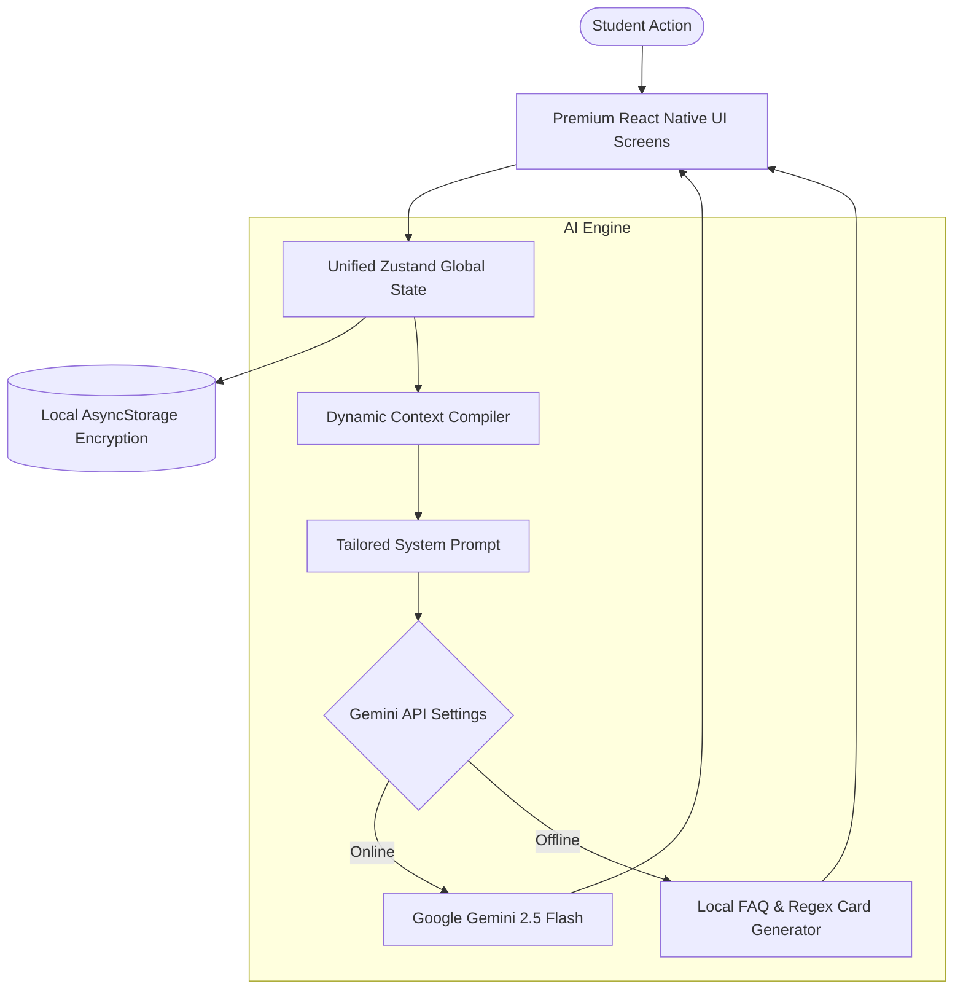

# Hi there, I'm Dale (b0urbonn) 👋

<p align="center">
  
</p>

<p align="center">
  <a href="https://github.com/b0urbonn">
    
  </a>
  <a href="https://github.com/b0urbonn">
    
  </a>
  <a href="https://github.com/b0urbonn">
    
  </a>
  <a href="https://github.com/b0urbonn">
    
  </a>
</p>

---

## 🚀 About Me & Development Philosophy

I am a passionate **Mobile Software Engineer & UI/UX Craftsman** specializing in premium, high-performance, and secure mobile application ecosystems. I bridge the gap between stunning aesthetic designs (smooth gradients, glassmorphism, dynamic HSL colors, and micro-animations) and robust architectural logic (local-first state persistence, secure direct API connections, and off-grid offline fallbacks).

> [!NOTE]
> **My Core Philosophy:**
> - **Aesthetics Matter**: If a user interface feels generic or dry, the software has failed. Apps should feel alive and responsive.
> - **Local-First Privacy**: Users deserve complete ownership of their data. Sensitive student profiles, credentials, and note logs should live strictly on-device.
> - **Intelligent Co-Pilots**: Generative AI should not just be an empty prompt box. It should adapt contextually based on the user's real-time on-device states.

---

## 🛠️ My Premium Tech Stack

| Domain | Technologies & Frameworks |
| :--- | :--- |
| **Mobile Core** | React Native, Expo (SDK 56.0.0+), JavaScript (ES6+), TypeScript |
| **State & Local DB** | Zustand, React Hooks, Encrypted `AsyncStorage` states |
| **Styling & Assets** | Vanilla Native StyleSheet Engine, Dynamic HSL Themes, Custom SVG Assets |
| **AI & Generative Systems** | Google Gemini 2.5 Flash Integration, On-Device Fast Directive Regex Parsers |
| **Tooling & Pipelines** | EAS Build & CLI (Expo Application Services), Android SDK, Xcode compiler |
| **Version Control** | Git, GitHub Actions, Terminal Pipelines |

---

## 📂 Mega Project Spotlight: StudyTrack 📚

> **The Ultimate Premium AI-Powered Academic Co-Pilot & Student Tracker**
> 
> StudyTrack is a high-fidelity mobile workspace designed for high school and university students. Instead of managing assignments in checklist apps, schedules in calendar apps, and lectures in notepad files, StudyTrack aggregates the entire academic lifestyle into a singular, beautiful, secure dashboard powered by Zustand and the Google Gemini API.

### 📐 Structural System Architecture



---

### 🗂️ Project Directory & Codebase Breakdown

Below is the exact structural tree of **StudyTrack**, representing a clean, modular component architecture:

```text
StudyTrack/
├── android/                   # Native Android configuration (SDK, Gradlew wrappers)
├── src/                       # Application source root
│   ├── components/            # Reusable UI widgets (cards, task overlays, custom headers)
│   ├── constants/             # Design Tokens (HSL palette formulas, styling guides)
│   ├── hooks/                 # Custom React Hooks (theme selectors, weather, timers)
│   ├── navigation/            # Typed navigation stack bindings
│   ├── store/                 # Global Zustand database engines (local persistence)
│   ├── types/                 # Static TypeScript contracts & data interfaces
│   ├── utils/                 # General utility parsers & schedule conflict calculators
│   └── screens/               # Feature-specific screen modules
```

---

### 💻 Deep Dive: Screen-by-Screen Code Showcase

Here is a full mapping of the screen files located in the repository, representing the entire workspace modules:

#### 1. Academic & Grades Management (`src/screens/academic/`)
Managing courses, grade weights, and semesters under a secure database:
* 📄 **[AcademicYearListScreen.tsx](file:///c:/Users/dale/StudyTrack/src/screens/academic/AcademicYearListScreen.tsx)**: Manage educational years, displays summary of GWA (General Weighted Average).
* 📄 **[AddEditAcademicYearScreen.tsx](file:///c:/Users/dale/StudyTrack/src/screens/academic/AddEditAcademicYearScreen.tsx)**: Setting up start/end dates and visual labels for a school year.
* 📄 **[SemesterListScreen.tsx](file:///c:/Users/dale/StudyTrack/src/screens/academic/SemesterListScreen.tsx)**: Categorizes courses into distinct semesters (1st, 2nd, Summer Term).
* 📄 **[AddEditSemesterScreen.tsx](file:///c:/Users/dale/StudyTrack/src/screens/academic/AddEditSemesterScreen.tsx)**: Set active semester flags and bindings.
* 📄 **[CourseListScreen.tsx](file:///c:/Users/dale/StudyTrack/src/screens/academic/CourseListScreen.tsx)**: Visual grid displaying enrolled courses, instructors, and credit hours.
* 📄 **[AddEditCourseScreen.tsx](file:///c:/Users/dale/StudyTrack/src/screens/academic/AddEditCourseScreen.tsx)**: Add courses with specific colors, details, and room logs.
* 📄 **[CourseDetailScreen.tsx](file:///c:/Users/dale/StudyTrack/src/screens/academic/CourseDetailScreen.tsx)**: The heavy academic engine! Computes real-time GWA progress, lists upcoming assessments, and details instructor profiles.
* 📄 **[AddEditAssessmentScreen.tsx](file:///c:/Users/dale/StudyTrack/src/screens/academic/AddEditAssessmentScreen.tsx)**: Input specific tasks, quizzes, and projects with designated weight percentages.
* 📄 **[AddEditGradeCriteriaScreen.tsx](file:///c:/Users/dale/StudyTrack/src/screens/academic/AddEditGradeCriteriaScreen.tsx)**: Customize grade scales (e.g. 1.0 to 5.0 or A to F scales) per course.

#### 2. AI Academic Adviser & Fast Logging (`src/screens/more/`)
The centerpiece of the repository's interactive co-pilot system:
* 📄 **[ChatBotScreen.tsx](file:///c:/Users/dale/StudyTrack/src/screens/more/ChatBotScreen.tsx)**:
  - **Gemini 2.5 Flash Integration**: Secures an API Key locally, direct fetching to Google API.
  - **Context-Aware Advisor**: Generates a massive system context by compiling active courses, pending tasks, calendar schedules, and student profile data on the fly.
  - **Fast Directive Logging Parser**: By typing standard slash or text commands, the app intercepts users' input using strict regex to display custom confirmation cards. Skip form-filling completely!
    - *Example commands:*
      - `/task Finish Biology Lab priority high due 2026-05-30`
      - `/note Review cellular respiration steps during study session`
      - `/schedule Math 101 Mon 9am - 10:30am RM402`
  - **Offline Fallback**: Toggles to offline mode seamlessly if network drops or keys are omitted, using local instructions and manual FAQs.

#### 3. Tasks & Todo Ecosystem (`src/screens/tasks/`)
A tactile checklist manager for academic requirements:
* 📄 **[TaskListScreen.tsx](file:///c:/Users/dale/StudyTrack/src/screens/tasks/TaskListScreen.tsx)**: Fully interactive lists sorting tasks by priority and course bindings. Features custom swipe actions to edit or delete items.
* 📄 **[TaskDetailScreen.tsx](file:///c:/Users/dale/StudyTrack/src/screens/tasks/TaskDetailScreen.tsx)**: Deep information cards displaying checklist progress, priority status, and course bindings.
* 📄 **[AddEditTaskScreen.tsx](file:///c:/Users/dale/StudyTrack/src/screens/tasks/AddEditTaskScreen.tsx)**: Custom modal with slider priority scales and calendar due date selectors.

#### 4. Weekly Planner & Scheduler (`src/screens/planner/`)
Preventing schedule conflicts dynamically:
* 📄 **[PlannerScreen.tsx](file:///c:/Users/dale/StudyTrack/src/screens/planner/PlannerScreen.tsx)**: Beautiful hourly calendar layout visually mapping out course blocks.
* 📄 **[AddEditScheduleScreen.tsx](file:///c:/Users/dale/StudyTrack/src/screens/planner/AddEditScheduleScreen.tsx)**: Smart scheduler checking for existing lectures to prevent overlapping bookings.

#### 5. Focus Timer Module (`src/screens/focus/`)
A custom tool to conquer cognitive fatigue:
* 📄 **[FocusTimerScreen.tsx](file:///c:/Users/dale/StudyTrack/src/screens/focus/FocusTimerScreen.tsx)**: Premium Pomodoro study assistant featuring circular countdown timer rings, custom intervals (Focus, Short Break, Long Break), and automatic stage progressions.

#### 6. Student Digital ID Wallet (`src/screens/more/`)
Say goodbye to physical document worries:
* 📄 **[DigitalIdScreen.tsx](file:///c:/Users/dale/StudyTrack/src/screens/more/DigitalIdScreen.tsx)**: Renders beautiful scan-ready barcode and QR student cards. Securely links student ID data and local photo uploads of registration certificates.

#### 7. College Memories Scrapbook (`src/screens/more/`)
Because campus life is more than just grades:
* 📄 **[CollegeMemoriesScreen.tsx](file:///c:/Users/dale/StudyTrack/src/screens/more/CollegeMemoriesScreen.tsx)**: Premium photo board mapping dates and descriptions to capture memorable moments during college.

#### 8. Interactive Student Quest Log (`src/screens/more/`)
Academic gamification:
* 📄 **[StudentQuestScreen.tsx](file:///c:/Users/dale/StudyTrack/src/screens/more/StudentQuestScreen.tsx)**: Grants Experience Points (XP) and level-ups for completing tasks, writing notes, and keeping active focus sessions.

---

## 📈 My GitHub Stats Dashboard

<p align="center">
  <a href="https://github.com/b0urbonn">
    
  </a>
  <a href="https://github.com/b0urbonn">
    
  </a>
</p>

<p align="center">
  
</p>

---

## 🚀 Active Project Roadmap

- [x] Complete Unified React Native & Expo Mobile Ecosystem
- [x] Local Storage Database State Engine (Zustand & AsyncStorage)
- [x] Secure local-to-AI Gemini 2.5 Flash Integration with Context Compilers
- [x] High-Efficiency Logging Parser (Fast Card Directive Generators)
- [ ] Build & Package Offline Installable Binaries (Android APK / iOS build)
- [ ] Deploy Shared Remote Databases with End-to-End Encrypted Cloud Sync
- [ ] Incorporate campus localization maps and custom campus-wide messaging protocols

---

## 📬 Let's Connect!

I am always open to exchanging ideas about mobile architecture, AI developer utilities, and modern UI paradigms.

* 🌐 **GitHub**: [b0urbonn](https://github.com/b0urbonn)
* 💼 **Project Workspace**: [StudyTrack 📚](https://github.com/b0urbonn/StudyTrack)

<p align="center">
  <i>"Code is poetry in motion. Write it clean, make it beautiful, keep it secure." ⚡</i>
</p>
